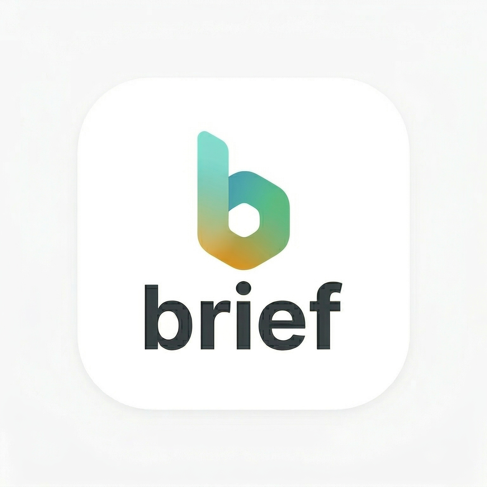

<div align="center">



# 📰 Brief — AI-Powered News Intelligence

**Your personal AI news assistant. Smarter. Faster. Bias-free.**

[](https://expo.dev)
[](https://reactnative.dev)
[](https://typescriptlang.org)
[](https://groq.com)

</div>

---

## ✨ What is Brief?

**Brief** is a next-generation AI-powered news application built for the modern reader. It doesn't just show you the news — it **understands** it, **verifies** it, and lets you **chat** with it.

### 🎯 Key Highlights
- 🧠 **Quad-AI Analysis** — Every article is processed by up to 4 AI engines simultaneously
- 🛡️ **Live Fact-Checking** — Real-time source verification before AI judgment
- 💬 **Chat with News** — Ask questions about any article in natural language
- 📰 **Multi-Source Feed** — Aggregated from 3 live news APIs with smart fallback
- 🌙 **Dark Mode** — Full app-wide dark/light theme with persistence
- 🇮🇳 **Hindi Support** — Complete UI translation between English and Hindi
- 🔍 **Smart Search** — Keyword search across all news providers
- 🔖 **Local Bookmarks** — Saved articles stored on-device, no account needed

---

## 🏗️ Architecture

```
Brief/
├── app/
│   ├── (tabs)/
│   │   ├── index.tsx        # Home feed with category tabs & search
│   │   ├── verify.tsx       # AI fact-check screen
│   │   ├── bookmark.tsx     # Saved articles
│   │   └── settings.tsx     # Theme, language & preferences
│   └── details.tsx          # Article detail + AI analysis + chat
│
├── components/
│   └── ChatDrawer.tsx       # Slide-up AI chat interface
│
├── services/
│   ├── news-api.ts          # 3-provider news fetching + keyword search
│   └── ai-service.ts        # 4-layer AI fallback engine
│
├── hooks/
│   ├── useNews.ts           # News fetching hook
│   ├── useBookmarks.tsx     # AsyncStorage bookmark persistence
│   └── useAppContext.tsx    # Global theme & language context
│
└── constants/
    └── apis.example.ts      # API key template (copy → apis.ts)
```

---

## 🤖 AI Fallback Chain

Brief uses a resilient **4-layer AI engine**. If one provider fails or is rate-limited, it automatically tries the next:

```
1. Groq (Llama 3.3 70B)          ← Primary — Ultra-fast inference
   ↓ (if fails)
2. Google Gemini (2.0 Flash)      ← Secondary — Deep reasoning
   ↓ (if fails)
3. Mistral AI (mistral-small)     ← Tertiary — Factual & reliable
   ↓ (if fails)
4. Hugging Face (Llama 3.2 3B)   ← Backup — Always available
```

---

## 📡 News Sources

| Provider | Usage | Endpoint |
|---|---|---|
| [NewsData.io](https://newsdata.io) | Category feed + keyword search | Primary |
| [GNews](https://gnews.io) | Category feed + keyword search | Secondary |
| [NewsAPI](https://newsapi.org) | Category feed + keyword search | Fallback |

---

## 🚀 Getting Started

### Prerequisites
- Node.js 18+
- Expo CLI (`npm install -g expo-cli`)
- Android device or emulator

### 1. Clone the repo
```bash
git clone https://github.com/Shyamkano/Brief.git
cd Brief
```

### 2. Install dependencies
```bash
npm install
```

### 3. Set up API keys
```bash
cp constants/apis.example.ts constants/apis.ts
```
Then open `constants/apis.ts` and fill in your API keys:

| Key | Get it from |
|---|---|
| `NEWS_API` | https://newsapi.org |
| `GNEWS` | https://gnews.io |
| `NEWSDATA` | https://newsdata.io |
| `GEMINI` | https://aistudio.google.com |
| `GROQ` | https://console.groq.com |
| `HUGGINGFACE` | https://huggingface.co/settings/tokens |
| `MISTRAL` | https://console.mistral.ai |

### 4. Start the development server
```bash
npx expo start
```

Scan the QR code with **Expo Go** on your phone.

---

## 📱 Build APK (Android)

```bash
# Install EAS CLI
npm install -g eas-cli

# Login to Expo
eas login

# Build APK (free, ~15 min on Expo cloud)
eas build -p android --profile preview
```

Download the `.apk` from the link provided after build completes.

---

## 🌟 Features In Detail

### 🗞️ Home Feed
- Category tabs: For You, Tech, Politics, Sports, Health
- Breaking News horizontal carousel
- Pull-to-refresh
- Live keyword search with multi-provider fallback

### 📰 Article Detail
- **AI Summary** — Bullet-point intelligence report
- **Impact Analysis** — "How this affects you"
- **Perspective Lens** — Left / Neutral / Right political view
- **EN/HI Switch** — Toggle language per article
- **Text size slider** — Adjust reading comfort
- **Share & Bookmark** — One-tap actions

### 🛡️ Verify (Fact-Check)
- Paste any headline or URL
- Live web search → AI cross-reference → verdict
- Trust score percentage bar
- Full verification history

### 💬 Chat with News
- Context-aware AI chat about the current article
- Dark mode support
- Hindi language support

### ⚙️ Settings
- Dark / Light theme toggle (persisted locally)
- English / Hindi language switch
- No account or login required
- All data stored on-device via AsyncStorage

---

## 🔒 Privacy

Brief is designed with **privacy-first** principles:
- ❌ No user accounts
- ❌ No backend server
- ❌ No data collection
- ✅ All bookmarks and settings stored locally on your device

---

## 🛠️ Tech Stack

| Technology | Purpose |
|---|---|
| React Native + Expo | Cross-platform mobile framework |
| TypeScript | Type safety |
| Expo Router | File-based navigation |
| AsyncStorage | Local data persistence |
| Lucide Icons | Icon library |
| Axios | HTTP requests |

---

## 📄 License

MIT License — free to use, modify and distribute.

---

<div align="center">

Made with ❤️ for informed citizens

**Brief** © 2026

</div>
